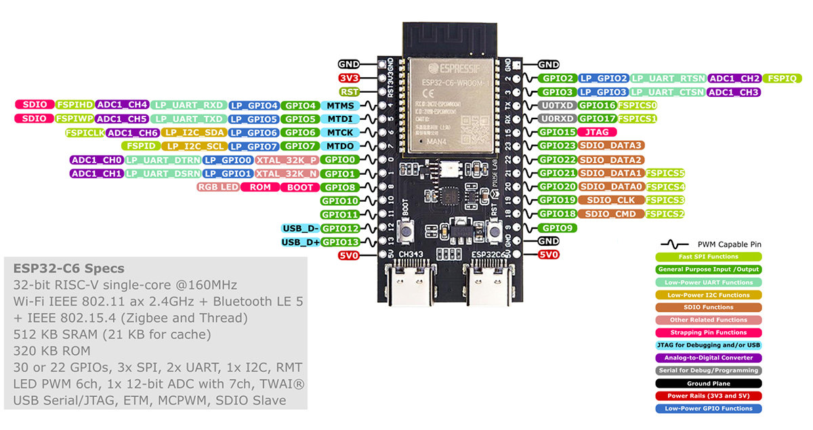
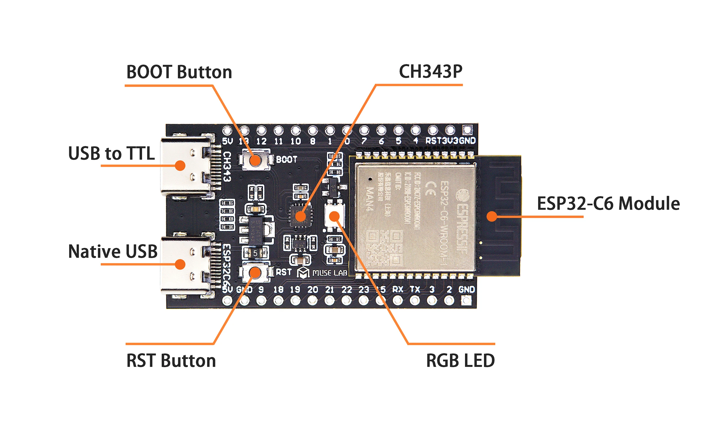

# ESP32-C6-CircuitPython

Initial development for ESP32-C6 using Circuitpython






---
## Install

First connect to the `CH343` Type C USB

Command

```
esptool --chip auto --port COM5 chip_id
```

Answer

```
Detecting chip type... ESP32-C6
Chip is ESP32-C6 (QFN40) (revision v0.0)
Features: WiFi 6, BT 5, IEEE802.15.4
Crystal is 40MHz
```

Command

```
esptool --chip auto --port COM5 flash_id
```

Answer

```
Detected flash size: 16MB
```

Enter the official site in Downloads and search `ESP32-C6`. Today we don't have the version 16MB (N16) yet. So we are going to use the 8MB (N8) one in [this link](https://circuitpython.org/board/espressif_esp32c6_devkitc_1_n8/). Just click `Download .bin now`

Let's first erase the flash

```
esptool --chip esp32c6 --port COM5 erase_flash
```

Now Let's install the bootloader

```
esptool --chip esp32c6 --port COM5 write_flash 0x0 adafruit-circuitpython-espressif_esp32c6_devkitc_1_n8-pt_BR-9.1.0.bin
```

Install [Thonny](https://thonny.org) IDE

Go in the `Tools> Options > Interpreter` and select `Circuit Python (generic)`

After doing the basic setup, change the port to `ESP32C6` Type C USB with the `USB JTAG/serial debug unit` option and start programming :)

If you have trouble setting it up. Follow [this video](https://www.youtube.com/watch?v=ojgtifRVI5s)

## Examples

Let's start developing! The first thing after setting it up it figuring out the variables to call so we can blink the board's LED. In the Thonny's builtin shell let's use the following commands.

```
>>> import board

>>> dir(board)
['__class__', '__name__', 'IO0', 'IO1', 'IO10', 'IO11', 'IO12', 'IO13', 'IO15', 'IO18', 'IO19', 'IO2', 'IO20', 'IO21', 'IO22', 'IO23', 'IO3', 'IO4', 'IO5', 'IO6', 'IO7', 'IO8', 'IO9', 'NEOPIXEL', 'RX', 'TX', 'UART', '__dict__', 'board_id']

>>> board.NEOPIXEL
board.IO8
```

Those are all the variables set for us to call in our code. For the built in LED we are going to use `NEOPIXEL` that is located in the `IO8` pin.

### Branch: Blink

Before running the code we need to download the `Libraries Bundle` in the [official site](https://circuitpython.org/libraries). 

Select the `Bundle for Version 9.x` and download it. 

Unzip the file and inside the `Thonny` IDE select the option `View>files` in the menu. Now the files in your computer and inside the device are being shown. Click in the `lib` folder in the `ESP32` and find the file `neopixel.mpy` inside the bundle that you have downloaded and then right click with you mouse and select the `Upload to /lib` option.

```
import time
import neopixel
import board
import sys, os

def cycleNeopixel(wait):
    print("RED")
    for r in range(255):
        pixel[0] = (r, 0, 0)
        time.sleep(wait)
    for r in range(255, 0, -1):
        pixel[0] = (r, 0, 0)
        time.sleep(wait)
        
    print("GREEN")
    for g in range(255):
        pixel[0] = (0, g, 0)
        time.sleep(wait)
    for g in range(255, 0, -1):
        pixel[0] = (0, g, 0)
        time.sleep(wait)
        
    print("BLUE")
    for b in range(255):
        pixel[0] = (0, 0, b)
        time.sleep(wait)
    for b in range(255, 0, -1):
        pixel[0] = (0, 0, b)
        time.sleep(wait)
        
print("=========================================")
print("CircuitPython NeoPixel exercise")
print("to control onboard RGB NeoPixel")
print("-----------------------------------------")
print(sys.implementation[0], os.uname()[3],
      "\nrun on", os.uname()[4])
print(neopixel.__name__, neopixel.__version__)
print("board.NEOPIXEL: ", board.NEOPIXEL)
print("=========================================")
print()

# Create the NeoPixel object
pixel = neopixel.NeoPixel(board.NEOPIXEL,
                          1,
                          pixel_order=neopixel.GRB)
pixel[0] = (0, 0, 0)
time.sleep(2.0)

cycleNeopixel(0.005)

pixel[0] = (0, 0, 0)
time.sleep(2.0)

print("- bye -\n")
```